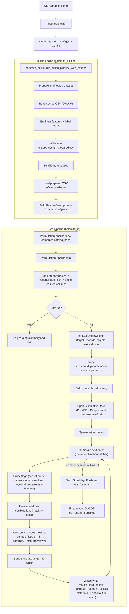

# Barsmith

High-performance feature combination search over engineered OHLCV bars.

WARNING: This repository is currently unstable. Use at your own risk.

Barsmith is a Rust research tool for exploring large feature-combination spaces
over market bar data. It is built for long local runs where deterministic
enumeration, safe resume, and predictable throughput matter more than UI polish.

Barsmith is designed for long-running, resume-friendly exploration runs:
- Load a CSV dataset, engineer features, and search combinations up to a configurable depth.
- Persist results incrementally (Parquet + DuckDB) so you can stop/restart without losing progress.
- Keep memory usage predictable via shared columnar data and reuse of intermediate masks.

This repository is self-contained; the supported workflows are implemented in Rust.

## Status and support boundary

Unstable. APIs, CLI flags, and output schemas may change without notice.

Currently supported by the default CLI:
- OHLCV CSV input.
- AND-only feature combinations.
- Builtin targets: `next_bar_up`, `next_bar_down`, and `next_bar_color_and_wicks`.
- Custom-engine targets through `--engine auto|custom`, including `2x_atr_tp_atr_stop`.
- Ranked formula evaluation against an existing `barsmith_prepared.csv`.
- Rust-native result querying, formula export, strict protocol manifests, overfit diagnostics, stress diagnostics, FRS exports, equity-curve exports, selection reports, and optional PNG plots.
- Local filesystem outputs, with optional `aws s3 cp` uploads.

Not supported by the default CLI:
- OR/mixed combination logic.
- Broker connectivity, order routing, or live execution.
- Arbitrary custom targets unless they are provided through a prepared dataset or implemented in a Rust engine.

## Key features

- **Combination search (`comb`)**: AND-only feature logic, depth limits, min-sample gating, optional feature-pairs, resume offsets.
- **Performance-gated evaluator**: inline combination storage, reusable batches, precomputed trade gates, and Rust-native hard-gate benchmarks for the search hot path.
- **Formula evaluation (`eval-formulas`)**: evaluate ranked formulas on a prepared dataset with the same stacking, sizing, cost, and equity semantics used by Barsmith.
- **Holdout-aware selection**: default pre-ranked, post-confirmed formula selection with explicit gate artifacts.
- **Strict selection workflow (`select`)**: one Rust-native path for discovery export, validation, overfit/stress diagnostics, and one-formula lockbox evaluation.
- **Strict research workflow**: protocol manifests, formula-export provenance, validation/lockbox/live-shadow stages, PBO/CSCV, PSR/DSR, and stress reports for overfit-resistant research.
- **Resume & durability**: incremental Parquet parts + a DuckDB view for fast `top results` queries.
- **Rust-native reporting**: query cumulative result stores and export formula results, FRS windows, equity curves, and optional plots without external scripts.
- **Deterministic runs**: stable CSV fingerprinting and run identity manifests to prevent accidental resume on incompatible inputs or settings.
- **Research-friendly runs**: deterministic dataset fingerprinting + resume metadata to protect long experiments.
- **Optional S3 upload**: upload outputs using `aws s3 cp` (requires AWS CLI on PATH).

## Quickstart

Requires Rust (stable).

Run a small dry-run on the included sample dataset:

```bash
cargo run -p barsmith_cli -- comb \
  --csv tests/data/ohlcv_tiny.csv \
  --direction long \
  --target next_bar_color_and_wicks \
  --dataset-id tiny_sample \
  --run-id quickstart_dry \
  --max-depth 3 \
  --min-samples 100 \
  --workers 1 \
  --max-combos 1000 \
  --dry-run
```

Run a real (small) exploration run:

```bash
cargo run -p barsmith_cli -- comb \
  --csv tests/data/ohlcv_tiny.csv \
  --direction long \
  --target next_bar_color_and_wicks \
  --dataset-id tiny_sample \
  --run-id quickstart_real \
  --max-depth 3 \
  --min-samples 100 \
  --workers 1 \
  --max-combos 10000 \
  --force
```

### Install (local)

Install the CLI binary from source:

```bash
cargo install --path barsmith_cli
```

Then run it as:

```bash
barsmith_cli --help
barsmith_cli comb --help
barsmith_cli eval-formulas --help
barsmith_cli results --help
barsmith_cli select --help
```

## Outputs (what gets written)

Barsmith writes each run into the standard run folder under `runs/artifacts`.
You’ll typically see:

- `barsmith_prepared.csv` (engineered dataset produced for the run)
- `run_manifest.json` (run identity used to validate safe resume)
- `command.txt` and `command.json` (command metadata for audit/replay)
- `results_parquet/part-*.parquet` (incremental result batches)
- `cumulative.duckdb` (DuckDB catalog and views over all batches)
- `barsmith.log` (unless `--no-file-log` is set)
- `checksums.sha256` and `reports/summary.md` (run closeout artifacts)

Barsmith can resume from an existing run folder only when the run manifest matches the current CSV fingerprint and resume-sensitive settings. Increasing `--max-depth` is allowed because the deterministic enumeration stream extends the already processed prefix. Use `--force` or a fresh `--run-id` for an incompatible run. When reusing an existing run folder, pass `--ack-new-df` so the CLI can overwrite `barsmith_prepared.csv`.

The standardized layout is the default:

```bash
cargo run --release -p barsmith_cli -- comb \
  --csv ../es_30m.csv \
  --target 2x_atr_tp_atr_stop \
  --direction long \
  --dataset-id es_30m_official_v2 \
  --run-slug no_stacking
```

This writes full artifacts under
`runs/artifacts/comb/<target>/<direction>/<dataset-id>/<run-id>/` and writes a
lightweight registry JSON under
`runs/registry/comb/<target>/<direction>/<dataset-id>/<run-id>.json`. Full
artifacts remain ignored by Git; registry records are meant for future audit
traceability without embedding local artifact paths or formula text. Combination
registry records include both best Calmar and best total-R summaries.

## Formula evaluation

`eval-formulas` evaluates a ranked formula file against `barsmith_prepared.csv`:

```bash
cargo run -p barsmith_cli -- eval-formulas \
  --prepared runs/artifacts/comb/2x_atr_tp_atr_stop/long/es_30m_official_v2/<run-id>/barsmith_prepared.csv \
  --formulas ./formulas.txt \
  --target 2x_atr_tp_atr_stop \
  --cutoff 2024-12-31 \
  --stacking-mode no-stacking \
  --position-sizing fractional \
  --dataset-id es_30m_official_v2 \
  --run-slug no_stacking_forward \
  --plot \
  --plot-mode combined
```

This writes forward-test artifacts under
`runs/artifacts/forward-test/<target>/<dataset-id>/<cutoff>/<run-id>/` and a
lightweight registry record under
`runs/registry/forward-test/<target>/<dataset-id>/<cutoff>/<run-id>.json`.
The default selection protocol chooses from the pre-window ranking and uses the
post window as confirmation evidence. Selection outputs include
`selection_report.json`, `selection_decisions.csv`, `selected_formulas.txt`, and
`reports/selection.md`.

For overfit-resistant research, prefer `barsmith_cli select validate` and
`barsmith_cli select lockbox`. The `select` workflow exports discovery
candidates, binds the formula manifest to a strict protocol, runs validation
with overfit and stress diagnostics, and records a machine-readable
`workflow_status`. Low-level `results` and `eval-formulas` remain available for
diagnostics and custom investigations.

Formula files use one AND-only expression per line, for example:

```text
Rank 1: trend_flag && rsi_7>40.0 && close<high
Rank 2: atr>=1.25 && volume>volume_sma_20
```

See `docs/selection.md` for the recommended selection workflow and `docs/cli.md`
for the complete grammar, FRS options, and plotting flags.

## How `comb` works



### Prepared dataset requirements (what the pipeline expects)

The core pipeline (`barsmith_rs`) expects a “prepared” dataset that contains:

- `target` as a boolean column (name is whatever you pass via `--target`)
- `rr_<target>` (optional) as a float reward per row (R units)
- `<target>_eligible` (optional) as a boolean gate for trade eligibility
- `<target>_exit_i` (required when `--stacking-mode no-stacking`) as an integer next index to jump to after a trade

The default CLI generates this prepared dataset via `barsmith_builtin` and writes it to `runs/artifacts/.../barsmith_prepared.csv`.

Note: the built-in CLI always writes `barsmith_prepared.csv`. If that file already exists in the run folder, you must pass `--ack-new-df` to overwrite it.

## Data format

Input must be a CSV with (at minimum) these columns:

- `timestamp` (ISO-8601; UTC recommended)
- `open`, `high`, `low`, `close` (numeric)
- `volume` (numeric)

The default CLI uses `barsmith_builtin` for feature engineering + target labeling, and currently supports:

- `--target next_bar_up` (boolean)
- `--target next_bar_down` (boolean)
- `--target next_bar_color_and_wicks` (compatibility alias for `next_bar_up`)

For richer feature sets/targets, use `--engine auto` (default) or
`--engine custom` for targets implemented by `custom_rs`, including
`2x_atr_tp_atr_stop`. You can also use `barsmith_rs` as a library and provide
your own prepared dataset (see the requirements above).

## Validation

Common local gate:

```bash
cargo fmt --all --check
cargo clippy --workspace --all-targets --all-features -- -D warnings
cargo test --workspace --all-targets --all-features
RUSTDOCFLAGS="-D warnings" cargo doc --workspace --no-deps --all-features
cargo audit --deny warnings
scripts/golden_smoke.sh
scripts/performance_gate.sh
scripts/benchmark_smoke.sh
```

For the full testing matrix, benchmark fixture tiers, and review expectations,
see `docs/testing.md`, `docs/performance.md`, and `docs/review-checklist.md`.

## Docs

- `docs/README.md` (index)
- `docs/quickstart.md`
- `docs/data-contract.md`
- `docs/cli.md`
- `docs/runs.md`
- `docs/outputs.md`
- `docs/architecture.md`
- `docs/engines.md`
- `docs/performance.md`
- `docs/unsafe.md`
- `docs/testing.md`
- `docs/migration.md`
- `docs/stability.md`
- `docs/review-checklist.md`
- `docs/troubleshooting.md`
- `docs/development.md`

## CLI reference

List commands:

```bash
cargo run -p barsmith_cli -- --help
```

Search combinations:

```bash
cargo run -p barsmith_cli -- comb --help
```

Evaluate formulas:

```bash
cargo run -p barsmith_cli -- eval-formulas --help
```

Query stored results:

```bash
cargo run -p barsmith_cli -- results --help
```

### S3 upload

`--s3-output s3://bucket/prefix` enables upload targets and `--s3-upload-each-batch` uploads after every ingestion batch.

This uses the AWS CLI (`aws s3 cp`) and does not embed AWS credentials logic in Barsmith.

## Performance

Internal benchmark (not a guarantee): on a MacBook Pro (Apple M4), Barsmith explored ~120B combination candidates over ~5 days.

Use the Rust-native benchmark gate for performance-sensitive changes:

```bash
scripts/performance_gate.sh
```

When `target/barsmith-bench/baseline.json` exists, the default smoke gate
compares against it with `barsmith_bench compare --fail-on-regression`.
Targeted suites use matching local baselines, such as
`target/barsmith-bench/select-validate-baseline.json`, when those files exist.
Refresh a local baseline only after an accepted main-branch change:

```bash
BARSMITH_PERF_BASELINE=off \
  BARSMITH_PERF_REPORT=target/barsmith-bench/baseline.json \
  scripts/performance_gate.sh
```

The `smoke` benchmark suite covers combination enumeration, the synthetic `comb-eval` hot path, bitset scans, and core stats. For max-depth-5 refactors, also run `--suite comb-depth5`. For ATR target-generation refactors, build the benchmark runner with `--features target-generation` and run `--suite target-generation` before validating a larger local CLI profile.

Performance depends heavily on:
- feature catalog size and depth
- `--stats-detail` (`core` vs `full`)
- combination depth and AND-mask selectivity
- storage filters (`--min-samples`, `--max-drawdown`, reporting thresholds)
- CPU and memory bandwidth

## Sample long-run command (macOS)

This is an example command shape for a long local run with the default builtin target. It is macOS-specific (`caffeinate`) and this repo is marked unstable.

```bash
caffeinate -dimsu cargo run --release -p barsmith_cli -- comb --csv ../es_30m.csv --direction short --target next_bar_color_and_wicks --dataset-id es_30m_official_v2 --run-slug no_stacking --max-depth 5 --min-samples 4000 --date-end 2024-12-31 --feature-pairs --auto-batch --batch-size 8000000 --stats-detail core --report formula --top-k 10000 --max-drawdown 25 --max-drawdown-report 25 --min-calmar-report 1.0 --subset-pruning --asset MES --profile-eval off
```

## Project layout

- `barsmith_rs/`: core library (data loading, combination enumeration, evaluation, storage).
- `barsmith_builtin/`: minimal built-in feature engineering + targets (used by the default CLI).
- `barsmith_cli/`: CLI (`comb`, `eval-formulas`, and `results`).
- `barsmith_bench/`: Rust-native benchmark runner and regression comparison gate.
- `custom_rs/`: richer Rust feature engineering + targets used by `--engine custom` and by `--engine auto` for non-builtin targets.
- `tests/`: repository-level fixtures used by smoke tests.
- `benchmarks/`: benchmark fixture manifest docs and local smoke commands.
- `docs/`: user, contributor, architecture, testing, and migration docs.

## Open-source hygiene

This repo is private-first today, but it includes the usual open-source hygiene files:

- `LICENSE` (MIT)
- `SECURITY.md`
- `CONTRIBUTING.md`
- `CODE_OF_CONDUCT.md`
- crate metadata (`license`, `repository`, `rust-version`, etc.) in `Cargo.toml`
- `CHANGELOG.md`
- `rust-toolchain.toml` (pinned toolchain for consistent `rustfmt`/`clippy`)

## License

MIT — see `LICENSE`.

## Disclaimer

Barsmith is a research tool. It does not connect to brokers, place orders, or provide financial advice.
